<picture>
  <source media="(prefers-color-scheme: dark)" srcset="assets/logo-dark.svg">
  
</picture>

 

**Turning Sustainability Compliance Into Business Value**

AI-powered platform that streamlines ESG reporting, climate risk assessment, and internal controls.
Built for CFOs, Controllers, CSOs, and IR teams.

---

## Platform

<table>
  <tr>
    <td align="center" valign="top" width="25%">
       
      <a href="https://github.com/sustainlabs-ai/log-pose"><strong>🧭 Log Pose</strong></a>
        
      <em>Compliance Platform</em>
        
      Web SPA — interactive dashboard for sustainability reporting, materiality assessment, and climate risk visualization.
        
      
    </td>
    <td align="center" valign="top" width="25%">
       
      <a href="https://github.com/sustainlabs-ai/poneglyph"><strong>🗿 Poneglyph</strong></a>
        
      <em>ETL Framework & API</em>
        
      Domain-driven data pipeline following medallion architecture (Bronze → Silver → Gold). Serves processed data via REST.
        
      
    </td>
    <td align="center" valign="top" width="25%">
       
      <a href="https://github.com/sustainlabs-ai/ohara"><strong>📚 Ohara</strong></a>
        
      <em>Risk Modeling Sidecar</em>
        
      Stateless climate risk compute engine. Evidence-backed physical risk models communicating over HTTP via JSON Schema contracts.
        
      
    </td>
    <td align="center" valign="top" width="25%">
       
      <a href="https://github.com/sustainlabs-ai/pluton"><strong>⚙️ Pluton</strong></a>
        
      <em>Infrastructure as Code</em>
        
      Cloud resource provisioning — S3, CloudFront, ACM, IAM, Route 53. All infrastructure defined in Terraform.
        
      
    </td>
  </tr>
</table>

## Architecture

```mermaid
flowchart TB
    CDS["🌍 Copernicus CDS"]

    subgraph PONEGLYPH ["🗿 Poneglyph · Rust"]
        direction TB
        JOBS["poneglyph-jobs<br/>Async runner · reqwest"]
        ETL["poneglyph-etl<br/>DataFusion · Arrow"]
        API["poneglyph-api<br/>Axum · REST"]
        JOBS --> ETL
        ETL --> API
    end

    subgraph OHARA ["📚 Ohara · Python"]
        direction TB
        MODELS["Physical Risk Models<br/>FastAPI · xarray"]
    end

    subgraph INFRA ["⚙️ Pluton · Terraform"]
        direction TB
        TF["S3 · CloudFront · IAM<br/>ACM · Route 53"]
    end

    CDS -->|"NetCDF / ZIP"| JOBS
    JOBS <-->|"HTTP · JSON Schema"| MODELS
    ETL -->|"Bronze → Silver → Gold"| S3[("☁️ S3<br/>Parquet")]
    S3 --> API
    API -->|"REST API"| LP["🧭 Log Pose<br/>React · Tailwind · deck.gl"]
    TF -.->|"provisions"| S3
    TF -.->|"provisions"| API
    TF -.->|"provisions"| LP

    SCHEMA["📋 JSON Schema<br/>S3 bucket"]
    SCHEMA -.->|"contract"| MODELS
    SCHEMA -.->|"contract"| ETL
```

## Standards & Frameworks

Our platform supports compliance across major sustainability reporting standards:

| Standard | Scope |
|----------|-------|
| **IFRS S1 / S2** | Global sustainability & climate-related disclosures |
| **ESRS** | EU Corporate Sustainability Reporting Directive |
| **TCFD** | Task Force on Climate-Related Financial Disclosures |
| **SASB** | Industry-specific sustainability accounting |
| **GRI** | Global Reporting Initiative — impact materiality |

## Tech Stack

---

  Sustainlabs AI S.A. de C.V. 2025–2026. All Rights Reserved.

